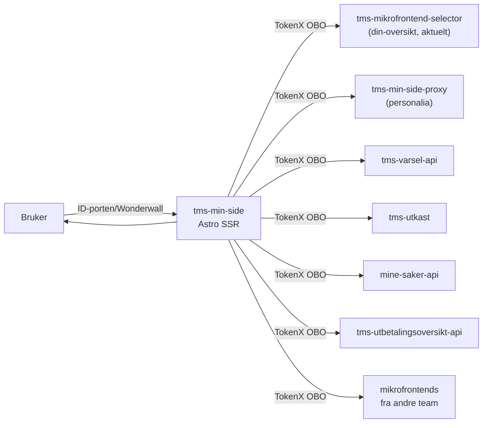

# Min side

Astro SSR-app som setter sammen personalisert innhold fra mikrofrontends for innloggede brukere på nav.no/minside. Appen er en container: den henter HTML fra andre teams mikrofrontends server-side og setter dem inn i siden.

## Formål

Min side er inngangsporten for innloggede brukere på nav.no. Den viser:

- personalia og varsler øverst
- aktive saker, ytelser og utkast i «Din oversikt»
- siste utbetalinger
- siste dokumenter og innboks
- innloggede tjenester og lenker

Siden tilpasses innloggingsnivå: brukere med MinID (substantial-innlogging) får et begrenset utvalg.

## Miljø

| Miljø | URL |
|-------|-----|
| Produksjon | [www.nav.no/minside](https://www.nav.no/minside) |
| Intern (dev) | [www.intern.dev.nav.no/minside](https://www.intern.dev.nav.no/minside) |
| Lokalt | http://localhost:4321/minside |

## Arkitektur

Appen henter HTML fra mikrofrontends server-side via OBO-token (TokenX) og setter HTML-en direkte inn i siden. Auth skjer via ID-porten og Wonderwall (Nais-sidecar).

Kodebasen bruker vertikal slice-arkitektur: all kode for én feature samles under `src/features/<feature>/`.

## Utvikling

Kjør `pnpm run` for å se alle tilgjengelige kommandoer. Lokalt kjøres appen på `http://localhost:4321/minside`. Mock-endepunkter serveres av `@navikt/astro-mocks` direkte fra Astro dev-serveren — ingen separat prosess kreves.

## Les mer

- [Vertikal slice-arkitektur](docs/VERTICAL_SLICE_ARCHITECTURE.md)
- [Ubiquitous language](docs/UBIQUITOUS_LANGUAGE.md)

## Henvendelser

Spørsmål til koden eller prosjektet kan stilles som issues her på GitHub.

For Nav-ansatte: send interne henvendelser på Slack i kanalen #team-minside.

